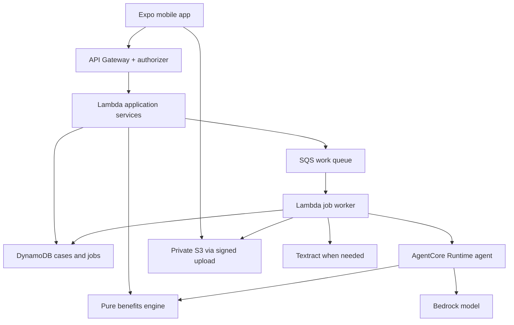
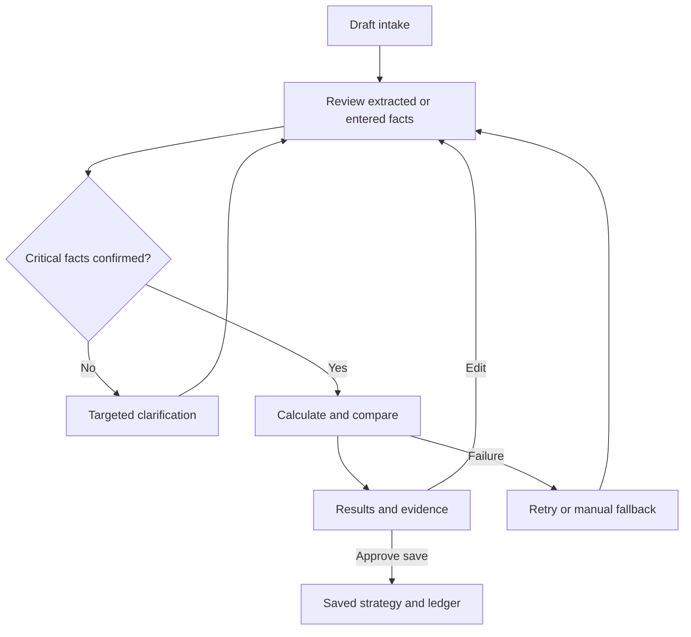

# 01 — System design and migration blueprint

ActionBridge Dental · v2.0 · All “target” components below require implementation unless marked existing.

## 1. Current source audit

The uploaded ZIP contains a **mobile application only**, not an AWS backend. The backend observations below come from the separate earlier `ActionBridge_Serverless_Starter.zip` and its available source. Neither was modified during this documentation pass.

| Area | Observed source | Keep / change |
|---|---|---|
| Mobile platform | Expo `~57.0.26`, React Native `0.86.3`, React `19.2.3`, npm lockfile | Preserve versions; validate installation before changing dependencies |
| Routes | `mobile/src/app/` contains thin Expo Router screens | Keep approach; migrate `program/[id]` to scenario details |
| Features | Intake, clarification, recommendations, approval, execution, ledger | Reuse visual patterns subject to event rules; replace referral models |
| Design | `theme/tokens.ts`, semantic light/dark palettes, Plus Jakarta Sans, Lucide icons | Preserve palette and component system |
| State | `store/flowMachine.ts` is a pure transition model | Add Dental states and revision-scoped events |
| API | `services/api/httpApi.ts` expects referral endpoints; casts JSON to TypeScript types | Replace contracts; add actual runtime validation |
| Mock selection | `services/api/index.ts` defaults to mocks and falls back when base URL is missing | Live mode must fail visibly on bad config, not silently become a demo |
| Authentication | HTTP adapter supports `getAccessToken`, but factory does not wire it | Add actual token provider before claiming authenticated access |
| Polling | Repeated errors are swallowed and polling continues | Add bounded retries, offline/expired states, cancellation and manual retry |
| Voice | `VoiceCapture.ts` generates levels and returns a fixed sample transcript | Mock only; no real recording or speech recognition implemented |
| Persistence | AsyncStorage snapshot key `actionbridge.v1` stores old cases and program IDs | Add Dental v2 migration/reset and synthetic-only cache policy |
| Tests | Five test files for mocks, state/store and question inputs | Coverage assets, not evidence that Dental works; not rerun here |
| Backend starter | `GET /health`, `POST /v1/cases`, `GET /v1/cases/{caseId}` | Generic persistence only; no estimate, agent, OCR or reminders |
| Backend errors | `{ error: { code, message, retryable, requestId } }` | Mobile currently expects top-level fields; standardize nested envelope |
| Infrastructure | SAM: HTTP API, three Lambdas, DynamoDB, logging/IAM | Extend incrementally; deployment was not verified here |

Changing only `EXPO_PUBLIC_API_BASE_URL` will **not** connect these projects. Their routes, models and error envelopes differ. Refactoring shared contracts is a first-stage requirement, not optional cleanup.

## 2. Architecture decisions

- One mobile codebase, one HTTP API, one agent. No Kubernetes, service cluster, or service mesh is needed.
- Pure calculation/optimization code is shared by API tools and the agent. No AWS SDK, React dependency, network access or clock lookup inside financial functions.
- AgentCore Runtime hosts a Bedrock-powered TypeScript agent. Runtime hosting is distinct from a Bedrock foundation model and from optional AgentCore Gateway. Gateway, Memory, Browser and Code Interpreter are not necessary for this bounded tool set.
- Fast estimates run synchronously. Model/document work uses persisted jobs so the phone can leave and resume.
- Thin adapters isolate AWS, OCR, notifications and storage. Core behavior remains testable without cloud credentials.
- All financial outputs carry input revision and calculator version. Edits invalidate stale results and approvals.

### Target component relationships



CloudWatch collects structured logs from services. Optional reminders add EventBridge Scheduler → reminder Lambda → chosen notification channel; keep that off the core request path. S3/Textract are added only with document upload. SQS is introduced when reliable asynchronous agent jobs are implemented, not for an ordinary arithmetic request.

### Runtime and event delivery

1. API validates caller, case ownership and input revision; creates a job and enqueues its ID.
2. Worker conditionally claims a lease for the job. Duplicate queue delivery must not create a duplicate result.
3. Worker invokes the configured Runtime version with a server-built, bounded context. The model does not choose tenant IDs, storage paths or permissions.
4. Agent runs allowlisted read/calculate tools. Its event callback emits sanitized status events, not private chain-of-thought. Worker validates received structured events and writes them to the job record.
5. Worker validates final output, records result/version and terminal status. If streaming events are unavailable, show only the genuine coarse stage “Analyzing”; do not invent completed tool stages.
6. Phone polls `GET /v1/jobs/{jobId}` with backoff, stops on terminal states and resumes from the persisted job after navigation/relaunch.

Start with a bounded worker run; fail/retry rather than pretend a Lambda can run indefinitely. Configure worker timeout, queue visibility, lease expiry and retry budget together. Multi-page OCR uses start/status/completion handling, not an endless request loop. The backend owns completion regardless of whether the phone remains connected.

## 3. Repository organization

| Target path | Responsibility |
|---|---|
| `mobile/src/app/` | Route wrappers and navigation layouts only |
| `mobile/src/features/<feature>/` | Screen, feature components, selectors and tests together |
| `mobile/src/components/` | Shared visual primitives; no benefits math |
| `mobile/src/services/` | Typed API, document, voice, notification and storage adapters |
| `mobile/src/store/` | Workflow transitions, case revision and result selection |
| `mobile/src/theme/` | Existing tokens and semantic palettes |
| `backend/src/features/<feature>/` | API handler, application service, ports, adapters and tests |
| `backend/src/functions/` | Lambda composition/entrypoints |
| `backend/src/shared/` | Narrow HTTP/config/auth/logging utilities |
| `backend/agent/` | AgentCore project, agent entrypoint, prompts, tool registry and evaluations |
| `packages/contracts/src/` | Runtime schemas and derived shared types |
| `packages/benefits-engine/src/` | Pure calculation, plan-rule validation and schedule search |
| `infra/` | SAM infrastructure and explicit ownership of resources |
| `docs/` | These five documents and fixtures |

Recommended backend features: `cases`, `estimates`, `schedules`, `agent-jobs`, `evidence`, `strategies`, `ledger`; later `documents` and `reminders`.

For example, `features/estimates/api/estimate-handler.ts` validates HTTP; `application/estimate-case.ts` loads an authorized case snapshot; `ports/case-reader.ts` defines the dependency; `infrastructure/dynamo-case-reader.ts` implements it. The application calls `@actionbridge/benefits-engine`. Tests live beside their feature or in a clearly matching test directory. Do not create empty architectural layers for every trivial function.

Dependency direction: route/handler → application service → domain functions and abstract ports. AWS implementations are injected at entrypoints. Use named exports, strict types, small coherent modules and explicit error results. Shared schemas have no native dependencies; only the backend imports secret-bearing SDK configuration.

Initial migration can retain the separate mobile lockfile and backend workspace lockfile. Do not combine dependency trees during the demo rush. A later shared workspace migration needs its own install/Metro/device gate; until then consume a built, versioned contracts package and validate both adapters against the same fixtures.

## 4. Shared data model

All money is nonnegative integer USD cents within a validated safe-integer bound; rates are integer basis points (0–10000). Dates are ISO date-only values for treatment/benefit periods; event timestamps are UTC ISO strings. Recurring reminders also store the user's IANA timezone.

| Entity | Minimum fields and semantics |
|---|---|
| `DentalCase` | ID, owner ID from auth, revision, status, plan, procedures, timestamps |
| `PlanYear` | Explicit start/end, annual insurer maximum, reported insurer-paid usage, deductible total and met amount, network/category rules, source/assumption references |
| `Procedure` | ID, optional confirmed code, label, plan-specific class, billed/allowed values, network, eligibility rules, proposed date, dentist-provided timing window and prerequisites |
| `SourceFact` | Field path, value, source ID, page/section/snippet, origin, extraction status, user confirmation, timestamp and conflict flag |
| `Estimate` | Case revision, engine version, ordered cost lines, per-year totals, overall totals, unresolved facts, assumptions and evidence IDs |
| `Scenario` | Schedule, feasibility result, estimate, baseline ID, estimated difference and assumptions |
| `AgentJob` | Case revision, operation, status, attempt, lease, sequence-numbered events, result/error, retry budget |
| `SavedStrategy` | Immutable selected scenario snapshot and originating revision; no insurer reservation |
| `LedgerEvent` | Server-generated event ID, actor, action/result, source revision and timestamp |
| `Reminder` | Strategy revision, consent, due time/timezone, channel, scheduling/delivery/cancel status and external reference |

Do not collapse origin and verification into one misleading badge. A plan value can be `document-extracted`, `user-confirmed`, and still **not insurer-confirmed**. An EOB can show one processed claim without establishing a complete current annual balance; record its as-of date and coverage of the evidence.

Critical unknowns are `null`/explicit unknowns, never default $0, 50%, January 1, or in-network. Reject conflicts or ask the user to resolve them. A market cost benchmark is not the employee's insurer allowed amount. CDT codes and benefit classes are not a universal coverage map; resolve against the actual plan.

## 5. Calculation rules and reconciliation

MVP supports one documented individual PPO-style coinsurance/max policy adapter. Copay/DHMO structures, family embedded deductibles, orthodontic lifetime limits, coordination of benefits, and complex alternate-benefit rules are unsupported unless separately implemented and tested. Detect and disclose them. ADA references describe common limitations, not the user's binding terms: [limitations](https://www.ada.org/resources/practice/dental-insurance/typical-dental-plan-benefits-and-limitations), [EOB terms](https://www.ada.org/resources/practice/dental-insurance/explanation-of-benefits-statement).

For a supported covered service whose documented rule applies deductible before coinsurance:

1. Validate eligibility, allowed amount, network terms, frequency/waiting restrictions and benefit year. Unresolved material rules produce `needs_information` or a clearly conditional estimate.
2. Determine billed charge `B`, eligible allowed amount `A` and contractual write-off `W`. Do not deduct `B-A` unless the provider contract supports that write-off.
3. Applied deductible `D = min(remaining deductible, eligible allowed amount)` when that service is subject to deductible; otherwise zero.
4. Candidate insurer payment `P0 = roundHalfUp((A-D) × insurerRateBps / 10000)`.
5. Payment `P = min(P0, remaining applicable insurer maximum)` when that cap applies. Policy exceptions such as preventive services not consuming the maximum require explicit flags.
6. Employee estimate `U = B-W-P` for this supported model. Show deductible, post-deductible coinsurance, cap shortfall and applicable balance bill as non-overlapping explanatory components.
7. Enforce `U + P + W = B`. Reject negative, non-finite or incompatible amounts.
8. Update projected deductible and insurer-payment usage sequentially. Reset only at the documented benefit-year boundary, including next year's deductible. Do not modify the reported paid baseline.

For integer implementation, use a safe bounded integer multiplication and explicit half-up cents rounding (or an integer/decimal library if ranges require it). Never round display dollars and feed them back into the engine. Document the rounding policy in engine versioning.

In-network example, fictional: charge $1,500, allowed $1,000, contractual write-off $500, deductible $50, rate 50%, sufficient max → insurer $475, employee $525. Out-of-network with the same $1,000 recognized amount and no write-off → insurer $475, employee $1,025, of which $500 is balance billing. These are policy assumptions, not universal provider rules.

Do not retain the earlier example that assigned $875 employee cost to a $1,500 charge/$1,300 allowed in-network service without accounting for its $200 write-off. This package requires every screen to reconcile to the engine.

### Schedule optimizer

Compare only dentist-permitted candidate dates and verified dependencies; unknown flexibility means no proposed postponement. Financial software does not label care “safe to wait.”

MVP algorithm: validate an acyclic dependency graph; assign at most two meaningful permitted date candidates per procedure (current/next benefit year); enumerate at most `2^6 = 64` assignments; reject invalid windows/dependency order; sort procedures by date plus stable tie-breaker; call the same calculator; de-duplicate financially equivalent results; return baseline and up to two alternatives.

If within-year order could change modeled costs, use the supplied clinical order or explicitly declare order fixed. Do not claim global optimization over arbitrary dates/orderings. Report “lowest estimated cost among the evaluated feasible options.” A next-year plan not supplied must be an explicit unchanged-plan assumption or block that comparison. No meaningful lower-cost alternative is a valid result.

## 6. Canonical target API

Base URL includes deployment stage, for example `https://<api-id>.execute-api.<region>.amazonaws.com/demo`. Adapters append the routes below; do not include `/v1` twice. These routes are **planned** except the three generic starter routes noted in the audit.

| Method and route | Purpose / contract | Phase |
|---|---|---|
| `GET /health` | Health/version only; no sensitive state | Existing generic |
| `POST /v1/cases` | Confirmed manual Dental inputs → `{caseId, revision}` | 3 |
| `GET /v1/cases/{caseId}` | Authorized case snapshot | 3 |
| `PATCH /v1/cases/{caseId}` | `{expectedRevision, changes}` → new revision; stale edits 409 | 3 |
| `POST /v1/cases/{caseId}/estimates` | `{expectedRevision}` → versioned estimate | 3 |
| `POST /v1/cases/{caseId}/scenarios` | `{expectedRevision}` → `{baseline, alternatives, limitations}` | 3 |
| `POST /v1/cases/{caseId}/jobs` | `{expectedRevision, operation, input}` for interpret/explain/analyze_document → 202 `{jobId}` | 5/6 |
| `GET /v1/jobs/{jobId}` | Owner-authorized status/events/questions/result | 5 |
| `POST /v1/jobs/{jobId}/answers` | Validated question IDs/answers/revision → new job and case revision | 5 |
| `POST /v1/jobs/{jobId}/retry` | New attempt after retryable failure; returns job ID | 5 |
| `POST /v1/jobs/{jobId}/cancel` | Best-effort cancellation; actual state returned | 5 |
| `POST /v1/cases/{caseId}/strategies` | `{scenarioId, expectedRevision, consent}` + idempotency key → stored snapshot | 6 |
| `GET /v1/cases/{caseId}/ledger` | Authorized events; pagination | 6 |
| `POST /v1/cases/{caseId}/uploads` | MIME/size/kind → short-lived signed upload and document ID | 6, optional |
| `POST /v1/reminders` | Strategy, time, channel and explicit consent → scheduling result | 6, bonus |
| `DELETE /v1/reminders/{reminderId}` | Authorized cancellation; report confirmation or pending state | 6, bonus |

Do not add plan-shopping or referral endpoints. For fresh conversational intake, create a draft case with missing values allowed, then run `interpret`; estimate endpoints reject incomplete critical inputs. Answers are authoritative only after schema validation and confirmation. Responses consistently distinguish `needs_information`, `estimated`, and `unsupported`.

Error envelope, shared by client and server:

```json
{
  "error": {
    "code": "REVISION_CONFLICT",
    "message": "Your plan changed. Recalculate before saving.",
    "retryable": false,
    "requestId": "request-demo-001"
  }
}
```

Use 400 for malformed inputs, 401/403 for access, 404 for unavailable owned resource, 409 for stale revision/idempotency conflict, 422 for incomplete or unsupported calculation inputs, 429 for rate limits and 5xx for service failures. Retry only safe reads or keyed writes with exponential backoff/jitter and a bounded attempt budget.

## 7. Workflow state and UI events



Job states: `queued`, `running`, `needs_information`, `completed`, `failed`, `cancelled`. Stage events include `jobId`, `caseRevision`, monotonic `sequence`, stage key, status and safe summary. Ignore stale job/revision events. Do not encode private model reasoning or document contents in status text. A successful estimate and a successfully scheduled reminder are different terminal outcomes.

## 8. Agent tools and limits

| Tool | Input boundary | Output / side effect |
|---|---|---|
| `extract_plan_terms` | Size-limited untrusted text plus source metadata | Proposed facts, references, unresolved/conflicting fields |
| `extract_treatment_terms` | Quote text; no inferred clinical urgency | Proposed procedures and uncertain codes |
| `find_missing_facts` | Validated draft case | Allowlisted questions tied to field paths |
| `retrieve_plan_evidence` | Authorized source IDs and field/rule IDs | Relevant exact passages/page references |
| `calculate_estimate` | Confirmed immutable snapshot | Pure authoritative estimate |
| `compare_schedules` | Same snapshot plus dentist constraints | Bounded feasible alternatives |
| `explain_results` | Stored result and cited evidence | Explanation with result references, not replacement totals |

Saving and reminder creation go through deterministic application services after user confirmation, not arbitrary model instructions. At most six tool calls and two clarification rounds by default for the demo; on limit, offer manual completion with a clear reason. A PDF can supply data but cannot authorize a tool, invent a recipient or change a system prompt.

## 9. Storage and security

One DynamoDB table per environment is sufficient. Use owner-scoped partition keys, e.g. `USER#<subject>#CASE#<caseId>`; sort keys for case metadata, revisions, estimates, strategies and ledger events. Jobs can use owner/job partitions. Add an index only for an observed query need. Avoid table scans. Use conditional writes for revisions, leases and idempotency records; transactionally couple strategy writes and their ledger event where appropriate.

Private S3 objects use server-generated owner/case/document prefixes. An authorized presign request enforces allowed types, small app-level size/page limits, checksum where supported, and expiry. Completion validates object metadata/content before parsing; filenames are not proof of type. No public bucket and no model-selected URLs.

Use a Cognito/OIDC JWT authorizer or explicitly controlled demo identity. Real documents require authentication and object-level authorization. A no-login demonstration must contain only synthetic data in an isolated, rate-limited environment; a shared public client value is not a secret or authentication.

Never cache real dental documents, tokens or medical details in unencrypted AsyncStorage. SecureStore can protect small session credentials, not turn all app storage into a secure records system. Logs contain IDs, timing, versions and error codes rather than raw documents/prompts. Define short demo-data retention and actual cleanup actions; DynamoDB TTL is eventual, not an immediate-delete guarantee.

Budget alerts are not spending caps. Limit request sizes, model tokens, invocations and concurrency. Do not claim HIPAA compliance or production readiness from this prototype architecture.

## 10. Verification strategy

Test each layer independently and together: contracts; pure calculator and optimizer; authorization/revision/idempotency; Bedrock extraction/evidence; state transitions; UI rendering and accessibility; phone-to-AWS end-to-end.

Required invariants: totals reconcile per procedure and year; annual max counts insurer payments; selecting/saving cannot double-count usage; invalid/fixed-date schedules never appear; missing values never become fictional facts; stale events cannot overwrite newer results; no external action without confirmed scope.

Failure behavior: AI outage → manual entry and calculator; OCR failure → editable input; missing benchmark → quote or explicitly unavailable comparison; provider network unknown → ask/conditional scenario; API outage → cached **labeled** result, not fabricated live success; notification denial → visible unavailable state.

Current technical sources and account setup are collected in [03_STACK_AWS_SETUP.md](03_STACK_AWS_SETUP.md). UI contract and numerical rendering rules are in [04_MOBILE_UI_AND_EXPO.md](04_MOBILE_UI_AND_EXPO.md).
