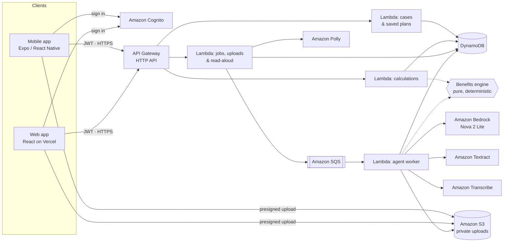

# ActionBridge Dental

**Know what your dental treatment will really cost — before the bill.**

ActionBridge is an **agentic, voice-first benefits assistant**. Upload your dentist's estimate and plan summary — or just talk — and it reads them, shows you exactly what it understood, asks only what's missing, and tells you what you'll pay under your current plan, including when timing treatment within your dentist's window could save you money. **Turn on voice and you never have to type or tap:** it reads each step aloud, listens to your answer, and moves on by itself.

> **AI reads. The calculator counts. You confirm.**
> The AI never does the math, nothing is used until you say "Yes", and treatment is only ever moved within dates your dentist allows.

| | |
|---|---|
| 🌐 **Web app** | **https://action-bridge-dental-web.vercel.app** |
| 📱 **Mobile app** | Expo (iOS and Android) — [run it in 2 minutes](#run-the-mobile-app) |
| 🔑 **Test login** | **Email:** `demo.judge@example.com` · **Password:** `DentalDemo2026!` |
| 📄 **Demo documents** | [`docs/demo/`](docs/demo/) — fictional estimate and plan summary to upload |

> The test account is shared on purpose for reviewers. It contains fictional data only — please don't enter real personal or health information.

---

## The problem

A patient is told: two fillings and a crown, **$1,500**. They have dental insurance, but no idea what *they* will pay. Dental plans cap what the insurer pays each **benefit year**; once the cap is used, the patient pays everything else. Few people know how much of their cap is left, or that it resets every year, so unused benefits quietly expire while people delay care or overpay.

In our reference case, doing everything now costs **$1,200**. Doing the crown a few weeks later — inside the window the dentist says is safe, but in the new benefit year — costs **$725**. Same care, **$475 less**. Working that out by hand means reading two documents and applying deductibles, percentages, annual maximums and the year reset.

## Built for everyone

Dental paperwork is confusing for anyone. For many people it's worse: small print they can't see, words they can't easily read, forms they can't fill in with their hands. **Understanding your own care shouldn't depend on any of that.** So ActionBridge can be used without reading the screen, and on the web without touching it at all.

| If you… | ActionBridge helps by… |
|---|---|
| **are blind or have low vision** | reading every key step aloud in a natural voice (Amazon Polly) as each screen opens, and labeling every control for screen readers |
| **find reading hard** (dyslexia, low literacy, English as a second language) | one question at a time, plain-language results ("you pay about $1,200, or $725 if…"), one-line definitions of every insurance term, all read aloud |
| **can't easily use your hands** | letting you do the whole flow by voice on the web: say *yes* or *not right*, pick options, say amounts ("about two hundred fifty dollars"), say *continue* |
| **are busy, older, or anxious about money** | one clear answer, your choices side by side, and a reminder before your benefits reset |

Turn on **Voice** in the top bar (or in Profile), upload your papers, and listen. ActionBridge asks, hears your answer, confirms it aloud and moves on.

## How we solved it

Three rules guide everything:

1. **The AI reads.** Amazon Bedrock (Nova 2 Lite) reads your words and documents and *proposes* facts through typed tools. Every value must quote the exact words it came from, and we check that quote word for word before showing it.
2. **The calculator counts.** A pure, deterministic engine (integer cents, no AI, 280+ tests) applies deductibles, percentages, yearly maximums and the benefit-year reset, and compares only dates your dentist allows.
3. **You confirm.** Nothing is used until you say yes. Anything unknown is asked, never guessed, and "I don't know" becomes a question for your dentist or insurer.

Around those rules sits an **agent that orchestrates the work for you**: background jobs on Amazon SQS read documents (Textract), transcribe voice (Transcribe), call the model with a bounded tool loop, ask only the questions that change your cost, and hand back results the voice agent can read aloud.

## Where the data comes from

- **Your own documents and words**: the dentist's estimate, your plan summary, a voice note or typed text. They're read once and deleted.
- **Plan rules come from your documents**, not from insurers. We don't connect to insurer systems or pull outside data.
- **Insurance terms** are explained with definitions we wrote (`packages/contracts/src/plain-language.ts`).
- **Demo data is fictional**: a shared reference case ([`docs/fixtures/`](docs/fixtures/dental-regression.json)) and two sample PDFs ([`docs/demo/`](docs/demo/)). No real patient data is used anywhere.

## How it works

1. **Tell us your way** — speak, type, upload the estimate and plan summary (multi-page PDFs too), or photograph them — all as one draft, analysed once.
2. **See what the AI understood** — one card at a time: *"Is this right? Crown · $1,000"* with the **exact words** it came from. Every quote is verified against your document. Nothing is used until you choose **Yes**.
3. **Answer only what's missing** — a few questions at a time, each with a one-line definition ("Annual maximum: the most your insurer pays in one benefit year"). *I don't know* becomes a question for your dentist or insurer, never a guess.
4. **Get the numbers** — a deterministic calculator (integer cents, fixed rules, 280+ tests) estimates each procedure, each benefit year, the timing options your dentist permits, and a self-pay comparison.
5. **Understand and act** — a plain-language summary ("you pay about $1,200 now, or about $725 if the crown waits until January") read aloud, two clear choices (*Everything as planned* vs *Crown in January · Save $475*), where every number came from, a saved plan, a question for your dentist, and **"$300 of benefits left this year"** with a reminder before they reset — **Add to Google Calendar**, Apple/Outlook calendar, or a phone notification.

## Hands-free voice agent

With **Voice on** (top bar or Profile), the assistant runs the whole conversation by voice:

| The assistant… | Example |
|---|---|
| **Reads the key words**, not the whole screen — dates and money spoken naturally | *"I found 6 things to check. Your benefit year: January 1, 2026 to December 31, 2026, annual maximum 800 dollars, insurer already paid 500 dollars. Is this right?"* |
| **Listens** for a few seconds after each question and understands the reply | *"Yes"* · *"Not right"* · *"In network"* · *"I don't know"* |
| **Fills in amounts you say** — the number appears in the box and is confirmed aloud | *"About two hundred fifty dollars"* → **$250.00** · *"Got it: $250."* |
| **Acknowledges and moves on** by itself, and says when it didn't catch you | *"Got it."* · *"Okay, I'll leave that out."* · *"Sorry, I didn't catch that."* |
| **Finishes the job** — submits on *"continue"*, then reads your result | *"Your estimate is ready. If you do everything as planned, you pay about 1,200 dollars…"* |

Spoken replies are understood with fixed rules (never guessed by the AI), every answer is shown on screen as *"I heard: …"*, and you can tap at any time. Voice output uses **Amazon Polly** (neural voice); listening uses the browser's speech recognition. On the phone the assistant reads every step aloud and you tap your answers.

## Architecture



### AWS services and what each one does

| Service | What we use it for |
|---|---|
| **Amazon Bedrock** (Nova 2 Lite, Converse API with tool use) | Reads the user's words and document text and **proposes** facts through typed tools (`record_case_facts`, `check_missing_facts`). It never calculates amounts. |
| **Amazon Textract** | Turns uploaded PDFs and photos into text: instant API for images and single pages, asynchronous API for multi-page PDFs (first 5 pages). |
| **Amazon Transcribe** | Converts voice notes (M4A from the phone, WebM/Ogg from browsers) into editable text. |
| **Amazon Polly** | Reads key screens aloud (neural voice) — the plain-language summary, each "Is this right?" card and each question — for people who prefer listening. |
| **AWS Lambda** (Node.js 22, arm64) | Five functions: health, cases and saved plans, calculations, jobs and uploads, and the agent worker. |
| **Amazon API Gateway** (HTTP API) | The public API: Cognito JWT authorizer on every route, CORS limited to our web origins, throttling. |
| **Amazon Cognito** | Sign-in for both apps. Admin-created accounts only, strong password policy, short-lived tokens. |
| **Amazon DynamoDB** | Cases, saved plans, jobs and an append-only activity ledger in one table. Every record is partitioned by its owner; writes are conditional on the case revision (no silent overwrites). |
| **Amazon SQS** (+ dead-letter queue) | Runs AI jobs in the background with retries, so the app stays responsive and a failure never loses work. |
| **Amazon S3** | Private, encrypted upload bucket. Browsers and phones upload directly with short-lived presigned forms that enforce size and file type. Files are deleted right after reading; a 1-day lifecycle rule is the backstop. |
| **Amazon CloudWatch** | Structured logs (IDs and timings only, never personal content), 7-day retention. |
| **AWS SAM / CloudFormation** | All infrastructure as code in [`infra/template.yaml`](infra/template.yaml); every change is reviewed as a change set before deploy. |
| **AWS IAM** | Least-privilege role per function (for example, only the worker can call Bedrock, Textract and Transcribe). |

### Other technology

React Native + **Expo** (mobile) · React + Vite, hosted on **Vercel** (web) · TypeScript everywhere · **Zod** contracts shared by the API and both apps · **Vitest** and **Playwright** (with axe accessibility checks).

## What makes it trustworthy

- **The AI proposes, never decides.** Every proposed value must quote the source text, and the quote is checked word for word. Amounts must appear in the quote.
- **Deterministic math.** The benefits engine is pure TypeScript with no I/O, AI or randomness, so the same input always gives the same answer.
- **Unknown stays unknown.** Missing values are never defaulted to $0, 50% or "in network"; they become questions.
- **Safe timing only.** Treatment dates move only inside a dentist-supplied window. No clinical advice.
- **Private by design.** Owner-scoped data, uploads deleted after reading, no secrets in the apps.
- **Saving is not a claim.** Saving a plan books nothing, submits nothing and contacts no one.

## Repository structure

```
action-bridge-dental/
├── mobile/                   # Expo app (iOS + Android): composer, assistant, results
├── web/                      # React web app (Vercel): landing, sign-in, full journey
├── backend/                  # Lambda handlers → services → ports → AWS adapters
│   └── src/features/         #   cases · estimates · schedules · strategies · ledger · agent-jobs
├── packages/
│   ├── contracts/            # Zod schemas shared by API, web and mobile
│   └── benefits-engine/      # Pure calculator and schedule comparison
├── infra/                    # AWS SAM template + live smoke-test scripts
└── docs/                     # Design, decisions, evidence, demo kit, fixtures
```

## Run it

Requires Node 22.13+.

```bash
npm run setup        # install everything and build the shared packages
npm run check        # strict typecheck + all tests (packages, backend, mobile logic)
```

### Run the mobile app

```bash
cd mobile
cp .env.example .env       # public API URL and Cognito client ID (stack outputs)
npm start                  # scan the QR code with Expo Go
```

### Run the web app locally

```bash
cd web
cp .env.example .env.local # same public values, VITE_ prefix
npm run dev                # http://127.0.0.1:5173
```

### Deploy the backend

```bash
npm run bundle -w backend
sam deploy --template-file infra/template.yaml --stack-name actionbridge-dental-dev \
  --capabilities CAPABILITY_IAM --resolve-s3 --no-execute-changeset   # review, then execute
bash infra/scripts/smoke-aws.sh   # live checks: API, agent, documents
```

## Verified

| Check | Result |
|---|---|
| Unit and integration tests (engine, contracts, backend, mobile logic) | **297 passing** |
| Web end-to-end tests (Playwright + axe, 360–1440 px), including a fully hands-free voice run | **12 passing** |
| Live checks against AWS (API, agent, documents, multi-page PDF) | **all passing** |
| Agent evaluation on Bedrock (complete, missing, contradictory, unsupported, prompt injection) | **5 / 5** — [results](docs/evals/agent-eval-results.md) |
| Reference case | **$1,200** all now vs **$725** crown after the reset ([fixture](docs/fixtures/dental-regression.json)) |

## Documentation

- [What we built, and how we know it works](docs/EVIDENCE.md)
- [Project brief](docs/00_PROJECT_BRIEF.md) · [System design](docs/01_SYSTEM_DESIGN.md) · [Decisions](docs/DECISIONS.md)
- [Demo kit and walkthrough](docs/demo/README.md) · [Contributing](CONTRIBUTING.md)

## Known limitations

- When next year's plan terms aren't stated, the assistant asks once whether the plan renews the same way; the cross-year option is then labeled "Assumes next year's plan stays the same".
- Hands-free voice answers need a browser with speech recognition (Chrome, Edge, Safari); the phone app reads aloud and you tap.
- Accessibility is built in and checked automatically (axe, labeled controls); it hasn't yet been tested with screen-reader users or people with disabilities — that's our next step.
- Supported plan model: deductible, percentage by service type, annual maximum. Waiting periods, exclusions and frequency limits are detected and reported as "can't estimate yet" rather than guessed.
- Estimates only — your dentist and insurer decide final treatment and costs.

---

*Built for CodeLinc 11. All demo data is fictional.*
